# Predições de vendas as Lojas ROSSMANN

## 1. Problema de Negócio

O CFO possui a necessidade de reformar as lojas da rede de farmácias, para melhorar a estrutura das lojas e atender melhor o público. Para tanto, ele necessita que os gerentes das lojas enviem a previsão de receita das próximas 6 semanas para que ele provisione o valor que será investido ppor cada loja no processo de reforma.

Atualmente, esses valores são calculados de forma individual, sendo que cada gerente realiza a entrega dessa previsão. Como cada loja possui fatores distintos que influenciam em seus resultados, como promoções, competições por clientes, feriados, sazonalidade e etc, e os cálculos são feitos de forma manual, os resultados variam muito.

Dessa forma, a ideia deste projeto é auxiliar o CFO na tomada de decisão, provendo resultados das previsões de cada loja de forma automática, e possibilitando que o CFO consulte as previsões através de um Bot do aplicativo Telegram.

## 2. Desafio 

### Problema
- Definição do Budget para a reforma das lojas.

### Causas
- Predição de Vendas Atual Apresentam muita divergência.
- O processo de Predição de vendas é baseado em Experiências passadas.
- Toda a previsão de vendas é feita manualmente pelas 1.115 Lojas Rossmann.
- As visualizações das vendas é limitada ao computador.
  
### Solução
- Usar Machine Learning para realizar a Previsão de Vendas de todas as lojas.
- Visualização das predições de vendas poderão ser feitas pelo Smartphone.

## 3. Desenvolvimento da solução

A sigla CRISP-DS (para Data Science), é uma metodologia cíclica que ajuda você a organizar seus pensamentos e códigos de maneira lógica e direta. 

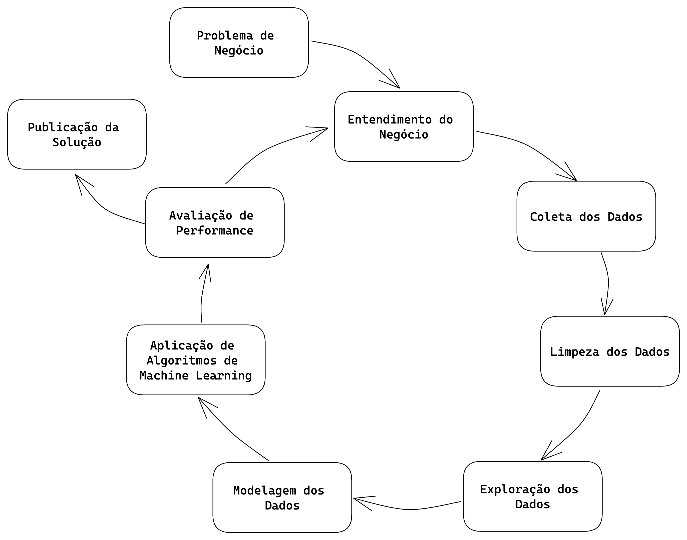
### Os 9 passos do CRISP-DS

1. **Problema de negócios**: É o primeiro contato com a área de negócios. Pode haver muitas informações fornecidas pela área de negócios, mas não entre em pânico ainda!
2. **Entendimento de Negócio**: Esta etapa tem como objetivo entender a dor do dono do problema e qual a sua real necessidade. Nesta etapa podem surgir protótipos da solução para validar com o dono do problema o que ele deseja como solução.
3. **Coleta de Dados**: Esta etapa tem como objetivo realizar a coleta dos dados, buscando eles nas tabelas do(s) banco(s) de dados da empresa.
4. **Limpeza dos Dados**: Esta etapa tem como objetivo remover toda e qualquer sujeira nos dados. Um dado sujo pode ser entendido como um dado que irá atrapalhar a performance final do algoritmo de Machine Learning. Tomando o cuidado entender bem o fenômeno que está sendo estudado para que não sejam removidos dados importantes para a modelagem do problema.
5. **Exploração dos Dados**: Esta etapa tem como objetivo entender os dados e como eles se relacionam entre si. Normalmente, são criadas hipóteses acionáveis de negócio que são posteriormente validadas utilizando técnicas de análise de dados. Além da criação de novas features que serão utilizadas na etapa de Modelagem de Dados.
6. **Modelagem dos Dados**: Esta etapa tem como objetivo preparar os dados para que eles sejam utilizados pelos algoritmos de Machine Learning. É nesta etapa que são feitos as transformações e encodign dos dados, a fim de facilitar o aprendizado do algoritmo utilizado.
7. **Aplicação de Algoritmos de Machine Learning**: Esta etapa tem como objetivo selecionar e aplicar algoritmos de Machine Learning nos dados preparados nas etapas anteriores. É nesta etapa que são selecionados os algoritmos e feito a comparação de performance enetre eles, para selecionar o algoritmos que melhor performou como algoritmo final.
8. **Avaliação de Performance**: Esta etapa tem como objetivo verificar a performance do algoritmo selecionado na etapa anterior com os resultados atuais, ou base line atual. Neste momento é feito a tradução da performance do algoritmo para perfomance de negócio. Ou seja, quanto a solução criada tratrá de retorno financeiro para a empresa. Caso a performance seja aceitável, o algoritmo é publicado e é retornado para a etapa de entendimento de negócio novamente, a fim entender melhor possíveis lacunas e assim melhorar a performance do algoritmo selecionado. Caso a performance não seja aceitável, o algoritmo não é publicado e é retornado para a etapa de entendimento de negócio para fazer uma nova iteração e assim melhorar a performance da solução.
9. **Publicação da Solução**: Esta etapa tem como objetivo publicar o algoritmo selecionado, deixando publico e utilizável a solução criada.

### Descrição do dados
Temos inicialmente um dataset de 1.017.209 linhas x 18 colunas para trabalharmos.

### Análise descritiva
Essas são as primeiras impressões descritivas dos dados.
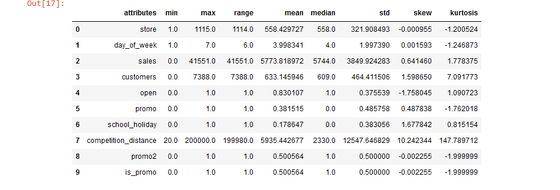

### Mapa Mental de Hipóteses

Utilizamos um mapa mental de hipóteses para temos um guia para a análise e exploração de fenômenos durante as análises exploratórias.

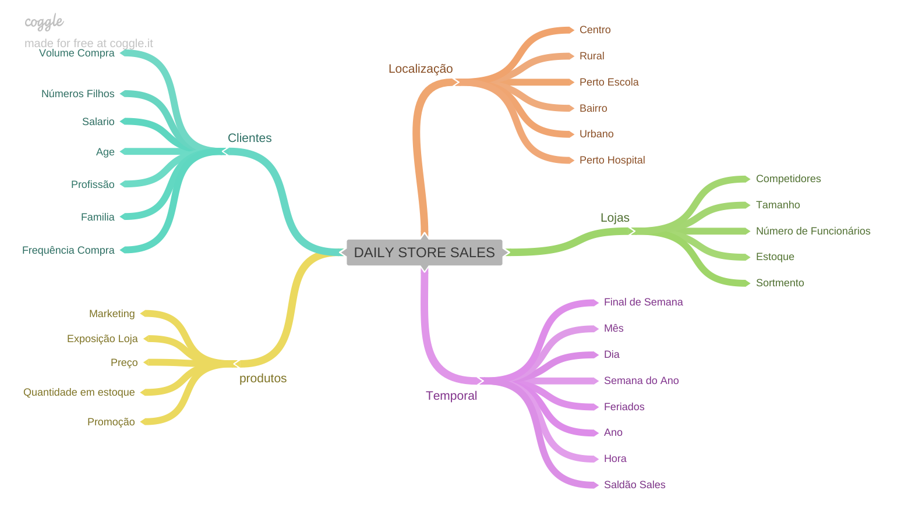

## 4 Análise Exploratória de Dados

## Variável Resposta

Distribuição da vida de cada loja, o quanto elas vendem ao longo de sua vida.
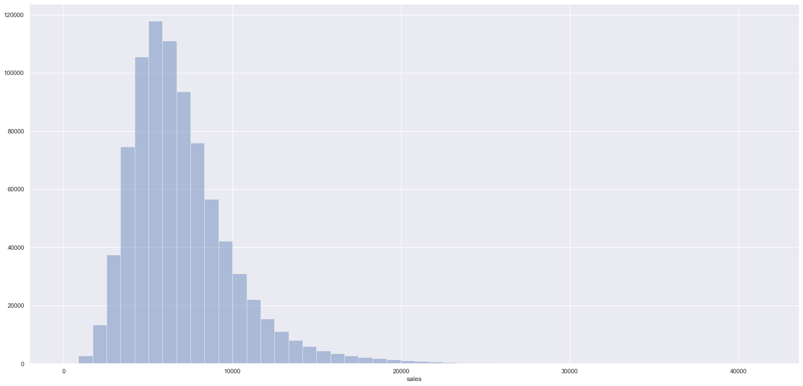

## Variáveis numéricas
Distribuição geral de algumas variáveis numéricas, mostrando alguns insights.
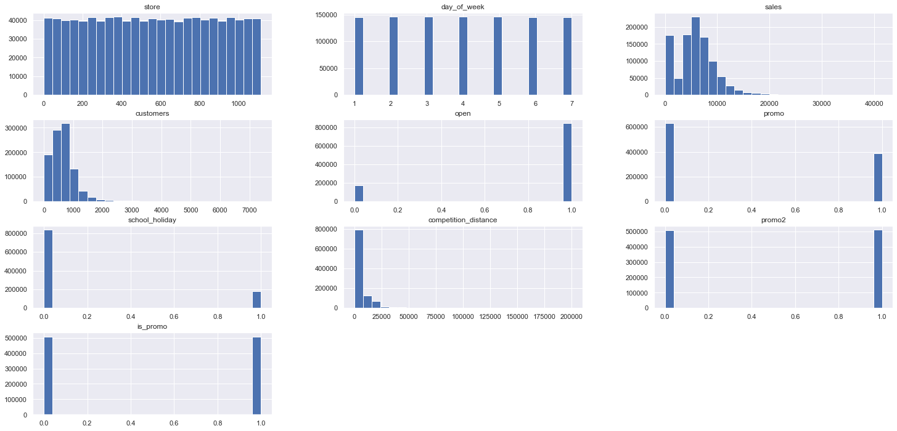

 ## Variáveis Categóricas
 Mostram algumas métricas de datas comuns e comemorativas, como natal, e do lado o volume de vendas comparadas aos outras datas.
 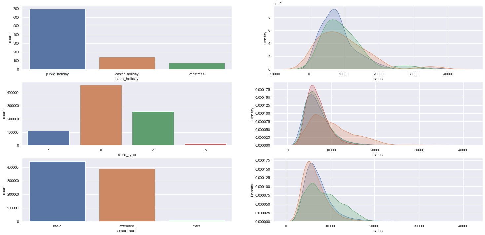

## 5 Validação das hipóteses

Vamos verificar se, as análises inicias conferem com as análises finais.

### H1. Lojas com maiores sortimentos deveriam vender mais.
**FALSA** : Lojas com o MAIOR SORTIMENTO vendem MENOS.
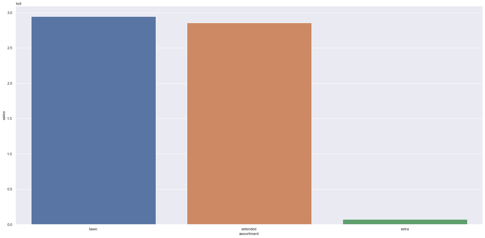

 ### H2. Lojas com competidores mais próximos deveriam vender menos.
 **FALSA** : Lojas com COMPETIDORES MAIS PRÓXIMOS vendem MAIS.
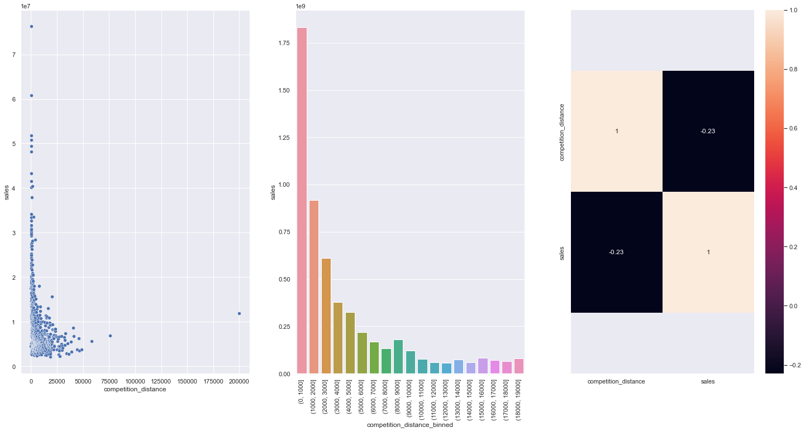

### H8. Lojas abertas durante o feriado de Natal deveriam vender mais.
**FALSA**: Lojas abertas durante o feriado do NATAL vendem MENOS.
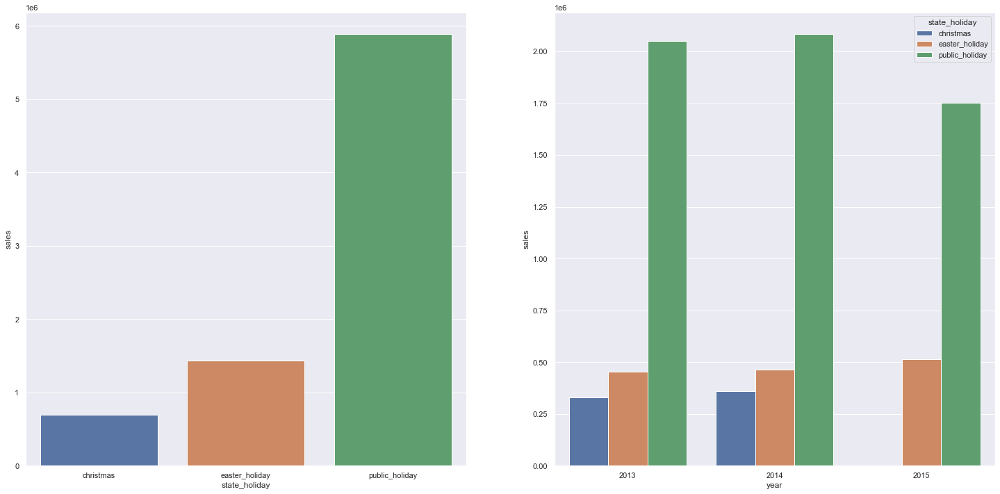

### H11. Lojas deveriam vender mais depois do dia 10 de cada mês.
**Verdadeira** : Lojas vendem mais depois do dia 10 de cada mês.
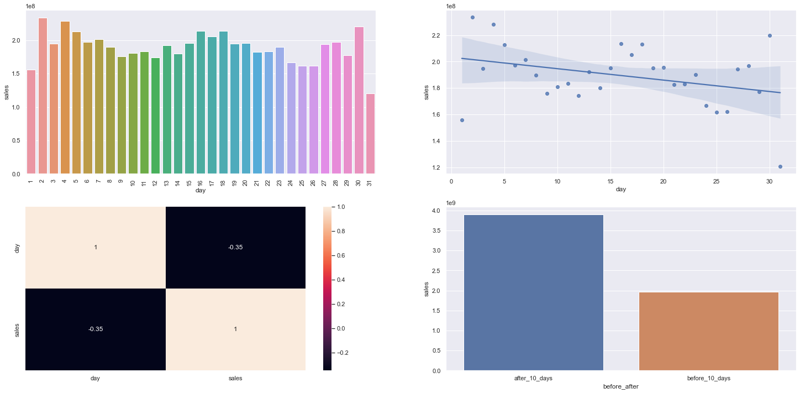

### Resumo das hipóteses
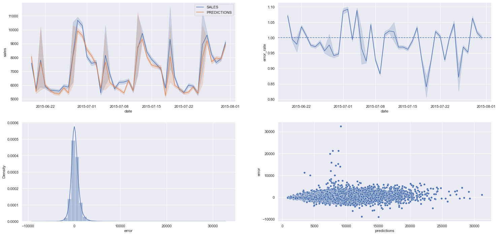

## 6 Análise Multivariada
### Atributos numéricos
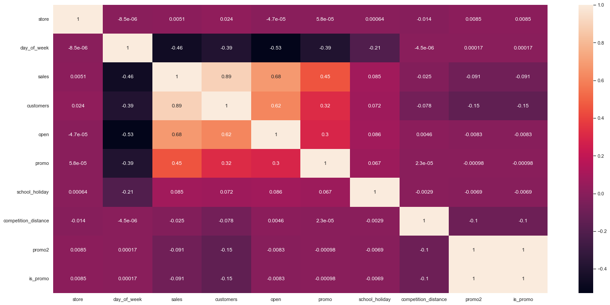

### Atributos categóricos
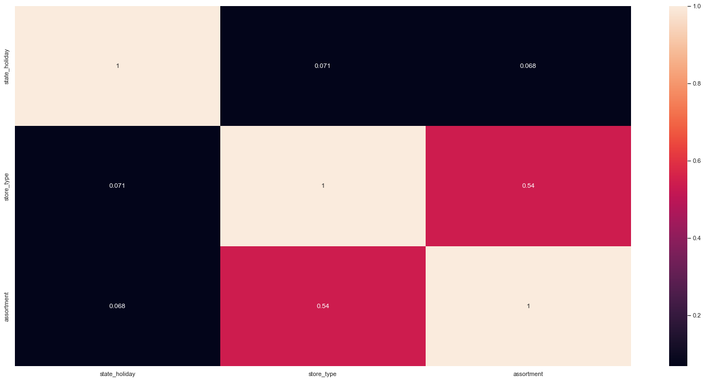

## 7. Machine Learning Modelling
Essas são as métricas e os modelos escolhidos para a análise, e os melhores colocados.
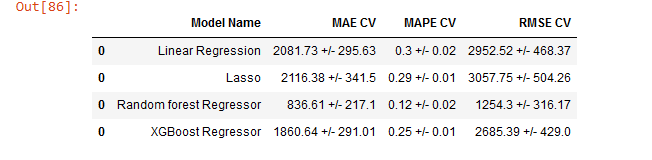

## 8. Conclusão & Demonstração

### Tradução e interpretação do erro

### Business Performance
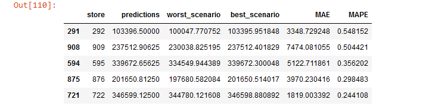

### Total Performance
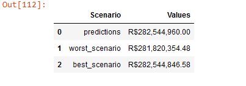

### Machine Learning Performance
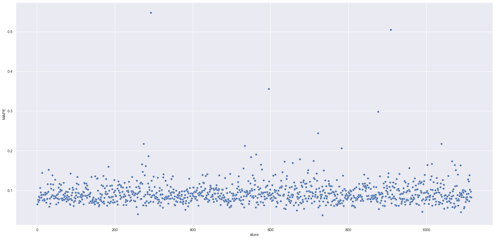

## 9. Próximos passos
- Workshop do Modelo para os  Business Users
- Coletar Feedbacks sobre a Usabilidade
- Aumentar em 10% a Acurácia do Modelo  
    
